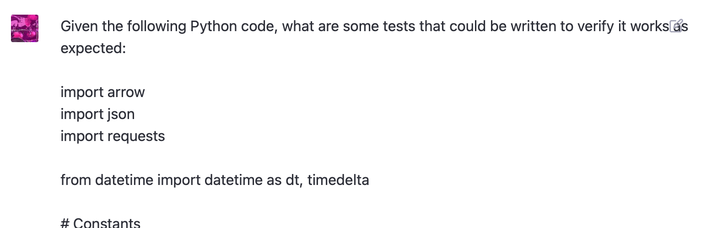
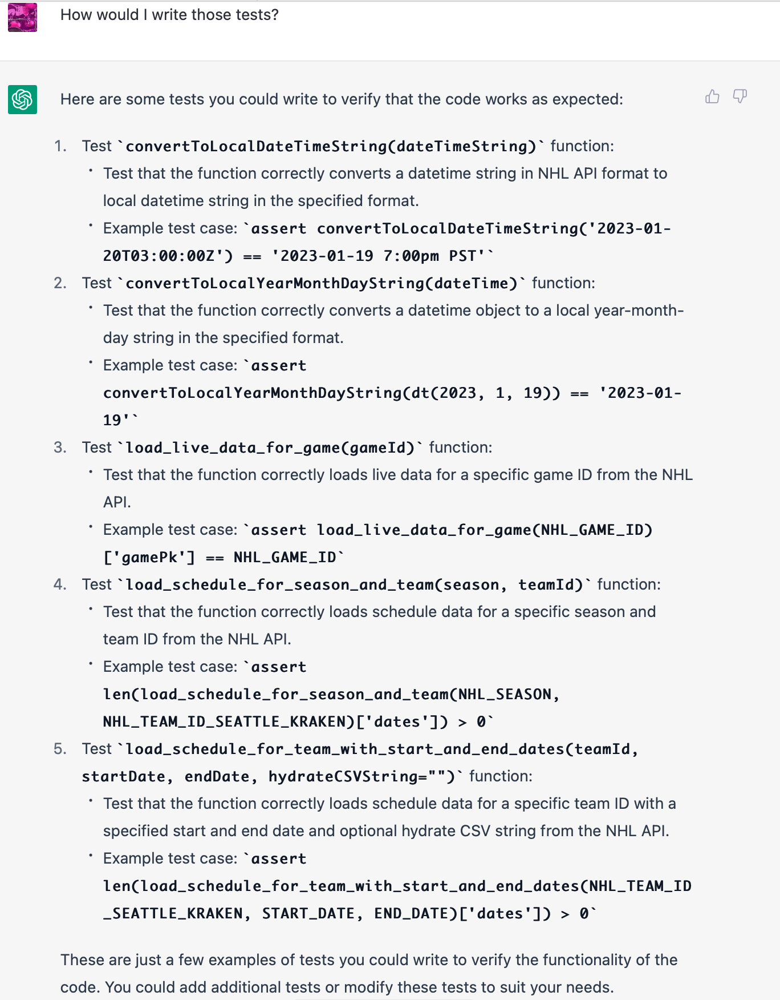
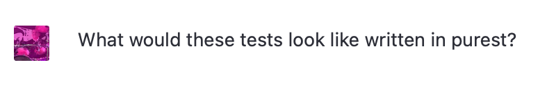
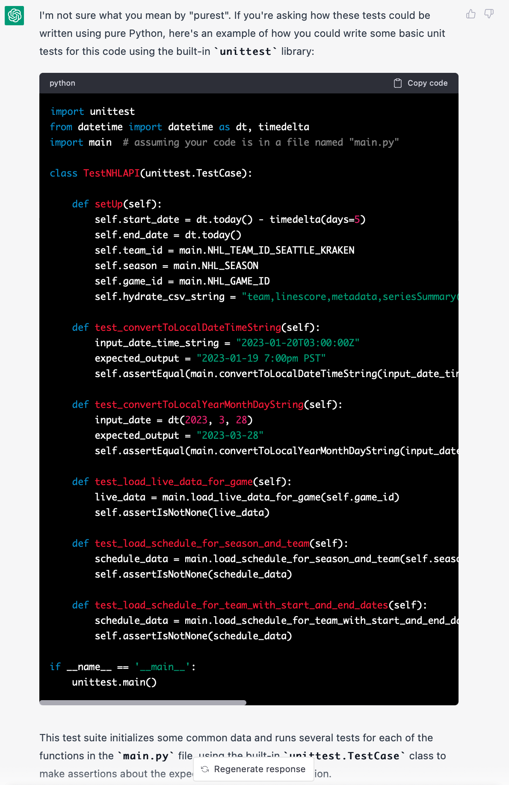

# Welcome
This is a draft of the content for an upcoming blog post from GenUI.

We wanted to experiment with ChatGPT and see what would happen if we supplied it with some example Python code and asked for advice on getting started to verify that it worked as expected.



## The initial prompt
Let's copy and paste the code from `../nhl_api.py` directly below our simple prompt of `Given the following Python code, what are some tests that could be written to verify it works as expected:`

Here is the full prompt - in all its glory:

```
Given the following Python code, what are some tests that could be written to verify it works as expected:

import arrow
import json
import requests

from datetime import datetime as dt, timedelta

# Constants
OUTPUT_SEPARATOR = "\n\n*****\n\n"

# Date and time
START_DATE = dt.today() - timedelta(days=5)  # '2023-02-20 16:13:23.094026'
END_DATE = dt.today()   # '2023-02-25 16:13:23.094026'
LOCAL_DATE_TIME_FORMAT_STRING = "YYYY-MM-DD h:mma ZZZ"  # '2023-01-19 7:00pm PST'
LOCAL_YEAR_DATE_MONTH_FORMAT_STRING = "%Y-%m-%d"

# NHL API
NHL_API_BASE_URL = "https://statsapi.web.nhl.com/api/v1"
NHL_API_DATE_TIME_FORMAT_STRING = "%Y-%m-%dT%H:%M:%SZ"  # '2023-01-20T03:00:00Z'

# NHL settings and configuration
NHL_SEASON = 20222023
NHL_TEAM_ID_SEATTLE_KRAKEN = 55

# Click on an individual game in the scorebar at https://www.nhl.com to get the game ID
NHL_GAME_ID = 2022021173


def convertToLocalDateTimeString(dateTimeString):
    # Convert '2023-01-20T03:00:00Z' to '2023-01-19 7:00pm PST'
    # See https://arrow.readthedocs.io/en/latest/guide.html#supported-tokens
    return arrow.get(dt.strptime(
        dateTimeString, NHL_API_DATE_TIME_FORMAT_STRING)).to('local').format(LOCAL_DATE_TIME_FORMAT_STRING)


def convertToLocalYearMonthDayString(dateTime):
    return dateTime.strftime(LOCAL_YEAR_DATE_MONTH_FORMAT_STRING)


def printJSON(data, indent=0):  # Utility method to either log or pretty print JSON data
    if indent == 0:
        print(OUTPUT_SEPARATOR + data + OUTPUT_SEPARATOR)
    else:
        print(OUTPUT_SEPARATOR + json.dumps(data,
                                            indent=indent) + OUTPUT_SEPARATOR)


# Load live data for a specific game ID from the NHL API
def load_live_data_for_game(gameId):
    # https://statsapi.web.nhl.com/api/v1/game/2022020728/feed/live
    NHL_API_LIVE_GAME_DATA_URL = NHL_API_BASE_URL + \
        "/game/" + str(gameId) + "/feed/live"
    live_data = requests.get(NHL_API_LIVE_GAME_DATA_URL).json()
    return live_data


# Load schedule data for a specific season and team ID from the NHL API
def load_schedule_for_season_and_team(season, teamId):
    # Build our schedule URL using team information from above
    NHL_API_SCHEDULE_URL = NHL_API_BASE_URL + \
        "/schedule?season=" + str(season) + \
        "&teamId=" + str(teamId)
    season_schedule = requests.get(NHL_API_SCHEDULE_URL).json()
    printJSON(season_schedule, 1)
    return season_schedule


# Load schedule data using a specified start and end date for a specific team ID with an optional hydrate CSV string from the NHL API
def load_schedule_for_team_with_start_and_end_dates(teamId, startDate, endDate, hydrateCSVString=""):
    # https://statsapi.web.nhl.com/api/v1/schedule?startDate=2023-01-19&endDate=2023-01-21&hydrate=team,linescore,metadata,seriesSummary(series)&teamId=55

    # Build our partial schedule URL using team information from above
    NHL_API_PARTIAL_SCHEDULE_URL = NHL_API_BASE_URL + \
        "/schedule?" + \
        "&startDate=" + convertToLocalYearMonthDayString(startDate) + \
        "&endDate=" + convertToLocalYearMonthDayString(endDate) + \
        "&teamId=" + str(teamId) + \
        "&hydrate=" + hydrateCSVString
    partial_schedule = requests.get(NHL_API_PARTIAL_SCHEDULE_URL).json()
    printJSON(partial_schedule, 1)
    return partial_schedule


# ------------------------------------------------------------------------------------------------
# Examples
# ------------------------------------------------------------------------------------------------
try:
    print('\nLet\'s explore the NHL API with Python 🐍\n')

    # - Load the Seattle Kraken schedule for the 2022-23 season
    # print('\tLoad the Seattle Kraken schedule for the 2022-23 season...')
    # load_schedule_for_season_and_team(NHL_SEASON, NHL_TEAM_ID_SEATTLE_KRAKEN)

    # - Load a subset of Seattle Kraken games and hydrate our response with additional details
    # print('\tLoad a subset of Seattle Kraken games and hydrate our response with additional details...')
    # hydrateWithCSVString = "team,linescore,metadata,seriesSummary(series)"
    # load_schedule_for_team_with_start_and_end_dates(
    #     NHL_TEAM_ID_SEATTLE_KRAKEN, START_DATE, END_DATE, hydrateWithCSVString)

    # Load live data for a specific NHL game
    # print('\tLoad live data for a specific NHL game...\n')
    # content = load_live_data_for_game(NHL_GAME_ID)
    # printJSON(content, 1)

except:
    print('\nWelp, that didn\'t work as expected.\n')
# ------------------------------------------------------------------------------------------------

```

ChatGPT was off to a great start - offering a response that identified several functions in the Python code and offered sample input with expected output values for tests that could be written.


## OK, ChatGPT. How would I write those tests?
The next step in our experiment was to see how ChatGPT might guide us in writing some initial tests to verify the code.

In this example, ChatGPT opted to show us how to write simple `assert` statements in Python that could verify functionality:




## What would those tests look like written in...%#@%#%@
In my adventures with Python, I've worked on several projects that used `pytest` for unit testing. 

What would these tests look like written in `pytest`?

Well, turns out autocomplete decided I didn't want to ask about `pytest` - and instead submitted a nonsensical prompt to ChatGPT - `What would these tests look like written in purest?`




Uhhhhh...what? I pictured ChatGPT momentarily stunned and shaking its head in disappointment.

Much to my surprise, ChatGPT politely told me it was unsure of what I meant by "purest" - and correctly suggested that if I wanted to write basic unit tests using pure Python, the following code might be useful.



ChatGPT generated the following Python code:

```python
import unittest
from datetime import datetime as dt, timedelta
import main  # assuming your code is in a file named "main.py"

class TestNHLAPI(unittest.TestCase):
    
    def setUp(self):
        self.start_date = dt.today() - timedelta(days=5)
        self.end_date = dt.today()
        self.team_id = main.NHL_TEAM_ID_SEATTLE_KRAKEN
        self.season = main.NHL_SEASON
        self.game_id = main.NHL_GAME_ID
        self.hydrate_csv_string = "team,linescore,metadata,seriesSummary(series)"
    
    def test_convertToLocalDateTimeString(self):
        input_date_time_string = "2023-01-20T03:00:00Z"
        expected_output = "2023-01-19 7:00pm PST"
        self.assertEqual(main.convertToLocalDateTimeString(input_date_time_string), expected_output)
    
    def test_convertToLocalYearMonthDayString(self):
        input_date = dt(2023, 3, 28)
        expected_output = "2023-03-28"
        self.assertEqual(main.convertToLocalYearMonthDayString(input_date), expected_output)
    
    def test_load_live_data_for_game(self):
        live_data = main.load_live_data_for_game(self.game_id)
        self.assertIsNotNone(live_data)
    
    def test_load_schedule_for_season_and_team(self):
        schedule_data = main.load_schedule_for_season_and_team(self.season, self.team_id)
        self.assertIsNotNone(schedule_data)
    
    def test_load_schedule_for_team_with_start_and_end_dates(self):
        schedule_data = main.load_schedule_for_team_with_start_and_end_dates(self.team_id, self.start_date, self.end_date, self.hydrate_csv_string)
        self.assertIsNotNone(schedule_data)

if __name__ == '__main__':
    unittest.main()

```

## Does it work, though?
Let's see. If you're familiar with Python, you should be able to create two files from the example above:

- [ ] `nhl_api.py` - This is the source code that we supplied in the initial prompt.
- [ ] `test_nhl_api.py` - This is a file that should exist in the same directory as the `nhl_api.py` file.
  - [ ] Note that we replaced the original `import main` line from ChatGPT with `import nhl_api`
  - [ ] We also replaced `main.` with `nhl_api.` to reflect the new import 

Assuming you are running Python from the directory containing these files, you should be able to run the original script on its own:

```
% python3 nhl_api.py

Let's explore the NHL API with Python 🐍

```

Now let's run the Python script using the code suggested by ChatGPT:

```
% python3 test_nhl_api.py

Let's explore the NHL API with Python 🐍

.....
----------------------------------------------------------------------
Ran 5 tests in 0.657s

OK

```

Well look at that. Our five tests ran and passed as expected. 🤓

Point goes to ChatGPT.
